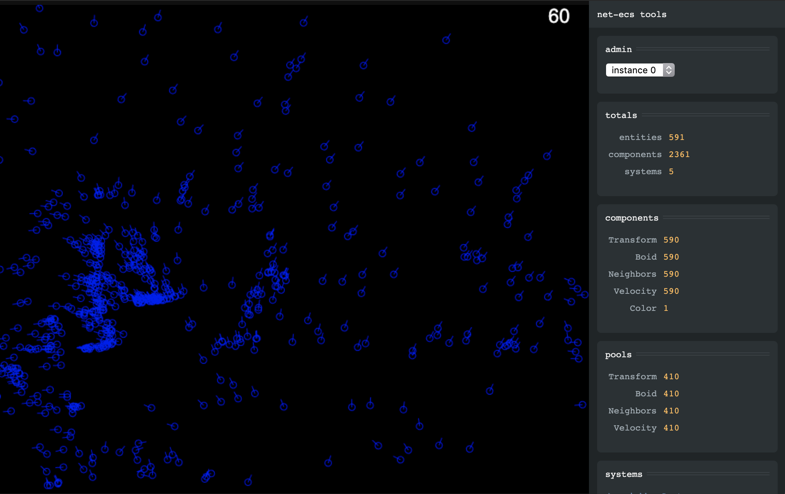

# net-ecs

A TypeScript Entity-Component-System with built-in network synchronization.

  

**NOTE: This code is untested, undocumented, and imperfect.** I am not an expert in the design and develoment of Entity-Component-Systems, nor networking. I built this project based on knowledge gained after many hours of informal investigation and experimentation around ECS and MOG concepts.

## Packages

| Script                                      | Description                     |
|---------------------------------------------|---------------------------------|
| [@net-ecs/core](./packages/core)            | Core ECS components.            |
| [@net-ecs/debug](./packages/debug)          | Developer tools built in React. |
| [@net-ecs/client](./packages/client)        | The net-ecs browser client.     |
| [@net-ecs/server](./packages/server)        | The net-ecs Node server.        |
| [@net-ecs/example-client](./example/client) | Drones client.                  |
| [@net-ecs/example-server](./example/server) | Drones server.                  |

## Scripts

| Script                | Description                          |
|-----------------------|--------------------------------------|
| `yarn example:build`  | Build the example client and server. |
| `yarn example:client` | Run the example client appliction.   |
| `yarn example:server` | Run the example server application.  |

## Concepts

### ECS
- Entities are integer ids.
- Entities have a one-to-many relationship with components.
- Components are JSON-serializable objects.
- Systems query entities by entity state (e.g. edded, removed, components changed) and/or component state (e.g. mutated) and read/write component state each tick.

### Networking

- Clients establish an unreliable channel for ephemeral state updates and a reliable channel for critical messages.
- Component types can be configured to use reliable or unreliable methods of synchronization.
- Reliable components are synchronized immediately when they are modified.
- Unreliable component types can be assigned priorities that influence how often their instances are synchronized.
- The maximum size of state update messages is configurable.

### Performance

- Components are pooled.
- Components are stored in a two-dimensional hash (`{ [type]: { [entity]: Component } }`) so lookups are fast.
- System queries are updated only when components change.

## Roadmap to V1
- [ ] API refinement
- [ ] Documentation
- [ ] Unit tests
- [ ] Integration tests
- [ ] Perf/load tests
- [ ] Delta compression - only send changed fields

## License
Copyright 2020 Eric McDaniel

Permission is hereby granted, free of charge, to any person obtaining a copy of this software and associated documentation files (the "Software"), to deal in the Software without restriction, including without limitation the rights to use, copy, modify, merge, publish, distribute, sublicense, and/or sell copies of the Software, and to permit persons to whom the Software is furnished to do so, subject to the following conditions:

The above copyright notice and this permission notice shall be included in all copies or substantial portions of the Software.

THE SOFTWARE IS PROVIDED "AS IS", WITHOUT WARRANTY OF ANY KIND, EXPRESS OR IMPLIED, INCLUDING BUT NOT LIMITED TO THE WARRANTIES OF MERCHANTABILITY, FITNESS FOR A PARTICULAR PURPOSE AND NONINFRINGEMENT. IN NO EVENT SHALL THE AUTHORS OR COPYRIGHT HOLDERS BE LIABLE FOR ANY CLAIM, DAMAGES OR OTHER LIABILITY, WHETHER IN AN ACTION OF CONTRACT, TORT OR OTHERWISE, ARISING FROM, OUT OF OR IN CONNECTION WITH THE SOFTWARE OR THE USE OR OTHER DEALINGS IN THE SOFTWARE.
