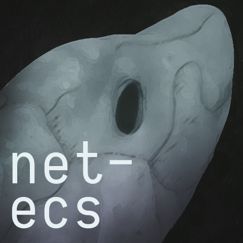

  

A flexible TypeScript Entity-Component-System with built-in strategies for network synchronization.

**This project is an active work in progress.**

## Packages

| Script                                      | Description                    |
|---------------------------------------------|--------------------------------|
| [@net-ecs/ecs](./packages/ecs)              | Core ECS                       |
| [@net-ecs/debug](./packages/debug)          | Developer tools built in React |
| [@net-ecs/client](./packages/client)        | The net-ecs browser client     |
| [@net-ecs/server](./packages/server)        | The net-ecs Node server        |
| [@net-ecs/example-client](./example/client) | Drones client                  |
| [@net-ecs/example-server](./example/server) | Drones server                  |

## Scripts

| Script                | Description                          |
|-----------------------|--------------------------------------|
| `yarn example:build`  | Build the example client and server  |
| `yarn example:client` | Run the example client appliction    |
| `yarn example:server` | Run the example server application   |
| `yarn test`           | Run all tests                        |
| `yarn perf`           | Run all performance tests            |

## Features

- **Performant**
  * Entities are organized into unique [Archetypes](https://csherratt.github.io/blog/posts/specs-and-legion/) so filtering and iteration is pretty fast. See how it's implemented in the [storage module](./packages/ecs/src/storage).
  * Unreliable components are assigned priorities that influence how often their instances are synchronized.
  * The maximum size of state updates is configurable.
  * Clients establish an unreliable channel for ephemeral state updates and a reliable channel for critical messages.
- **Extensible**
  * Data-oriented design: no classes or inheritance.
  * Tag entities with bit flags for quick filtering.
  * Create custom filters for more complex scenarios like change detection.
- **Unopinionated**
  * net-ecs is modular. For example, a `World` instance is provided, but not required for most features.
  * Bring your own component pooling.
  * No lobby system, auto-reconnect, etc.

## Concepts

### ECS
- Entities are integers.
- Entities are associated with one or more components via a data structure called [`Storage`](./packages/ecs/src/storage).
- Components are plain JS objects.
- Systems are just functions in your application that iterate collections of components obtained by executing one or more queries.

### Performance

Example `yarn perf` on a 2018 MacBook Pro where ~150k entities were iterated per tick at 60FPS:

```
========================================
perf_storage
========================================
entities      | 100000
components    | 4
queries       | 4
ticks         | 100
iter_tick     | 151298
avg_tick      | 16.15ms
========================================
perf_world
========================================
entities      | 100000
components    | 2
systems       | 2
ticks         | 100
iter_tick     | 102500
total_changed | 150000
avg_tick      | 11.91ms
```

## Roadmap to V1
- [ ] Documentation
- [ ] Unit tests (30%)
- [ ] Integration tests
- [ ] Perf/load tests (20%)

## License
Copyright 2020 Eric McDaniel

Permission is hereby granted, free of charge, to any person obtaining a copy of this software and associated documentation files (the "Software"), to deal in the Software without restriction, including without limitation the rights to use, copy, modify, merge, publish, distribute, sublicense, and/or sell copies of the Software, and to permit persons to whom the Software is furnished to do so, subject to the following conditions:

The above copyright notice and this permission notice shall be included in all copies or substantial portions of the Software.

THE SOFTWARE IS PROVIDED "AS IS", WITHOUT WARRANTY OF ANY KIND, EXPRESS OR IMPLIED, INCLUDING BUT NOT LIMITED TO THE WARRANTIES OF MERCHANTABILITY, FITNESS FOR A PARTICULAR PURPOSE AND NONINFRINGEMENT. IN NO EVENT SHALL THE AUTHORS OR COPYRIGHT HOLDERS BE LIABLE FOR ANY CLAIM, DAMAGES OR OTHER LIABILITY, WHETHER IN AN ACTION OF CONTRACT, TORT OR OTHERWISE, ARISING FROM, OUT OF OR IN CONNECTION WITH THE SOFTWARE OR THE USE OR OTHER DEALINGS IN THE SOFTWARE.
