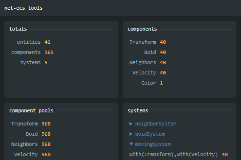

# @net-ecs/debug

Dev tool for debugging net-ecs `EntityAdmin` instances.



## Usage

### Local

```ts
import { createEntityAdmin } from "@net-ecs/core"
import { mount } from "@net-ecs/debug"

const world = createEntityAdmin()

mount(document.getElementById("debug")!)
```

#### Specify a specific `EntityAdmin` instance

```ts
const world = createEntityAdmin()
const world2 = createEntityAdmin()

mount(document.getElementById("debug")!, { target: world2 })
```

### Remote (not supported yet)

```ts
mount(document.getElementById("debug")!, { target: "ws://localhost:3000" })
```
